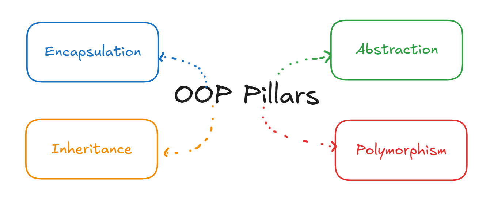

# 1. Introduction to OOP

## Programming Paradigms

A programming paradigm is an approach or style of writing code. The main ones are:

1. Object-Oriented Programming (OOP)
2. Declarative programming
3. Structured (procedural) programming
4. Functional programming

OOP is one of these styles, and many popular languages are built around it (Java, C++, C#, Python). Some languages support more than one paradigm. Kotlin, which is used for Android development, lets you mix OOP and functional programming, and C++ lets you mix OOP with procedural code.

OOP was created to solve real problems developers kept running into: large programs that become hard to read, hard to change, and full of repeated code. It is a tool you reach for when your code gets complex, and its goal is to make that code simpler and easier to maintain.

---

## Why OOP?

Even though syntax differs from one language to another, every language that supports OOP uses the same core concepts. OOP is a way of thinking, not a language, so once you understand it you can move between languages without starting over.

Without OOP, a big program tends to become one huge block of code with many lines and many standalone functions. Changing one thing means digging through the whole block and hoping nothing else breaks.

With OOP, the program is split into small components. Each component holds its own data and its own behavior. If something needs to change, you go to that one component, edit it, and leave the rest of the program alone.

---

## Class and Object

### Concept

A **class** is a blueprint (a model) that describes what something is and what it can do. An **object** is a real instance created from that blueprint.

### Explanation

Imagine building a game. The game has characters, rewards, enemies, and many other things. Before creating any specific character, you first design a model for characters: what properties they have (name, health, speed) and what they can do (move, attack, jump). That model is the class.

When you actually play, you use a specific character created from that model. That is the object. You can create as many objects as you want from one class, and each object has its own copy of the attributes. Changing the health of one character does not change the health of another.

This is the main shift OOP brings. Instead of writing a collection of loose functions, you work with objects that carry their own data and behavior.

A class is also a custom data type. If you are building a company system, you do not want to create a separate name, ID, age, and salary variable for every employee. You create one `Employee` class that holds all of that, plus functions like `calculateSalary()`, and then create as many employees as you need.

### Code (C++)

```cpp
#include <iostream>
#include <string>
using namespace std;

class Character {          // the class (blueprint)
public:
    string name;
    int health;

    void takeDamage(int amount) {
        health -= amount;
        cout << name << " now has " << health << " health\n";
    }
};

int main() {
    Character c1;          // object 1
    c1.name = "Link";
    c1.health = 100;

    Character c2;          // object 2, with its own separate data
    c2.name = "Zelda";
    c2.health = 150;

    c1.takeDamage(30);     // Link now has 70 health
    c2.takeDamage(10);     // Zelda now has 140 health
}
```

---

## Parts of a Class

A class is made of four main things:

1. **Constructors**: special functions that run when an object is created.
2. **Attributes**: the data the object holds. Also called variables, fields, or properties.
3. **Methods**: the actions the object can perform. Also called functions or behaviors.
4. **Access modifiers**: keywords that control what can be seen and used from outside the class (`public`, `private`, `protected`).

Put simply, attributes describe the object, methods are what it does, and access modifiers decide who is allowed to touch them.

---

## Attributes and Methods

If you are describing a game character, the character has **characteristics** (name, health, speed, level) and **actions** (run, attack, heal).

| What it is | Also called | Example |
|---|---|---|
| Characteristics | Attributes, variables, properties, fields | `name`, `health` |
| Actions | Methods, functions, behaviors | `attack()`, `heal()` |

Every object has its own copy of the attributes. The methods are shared code, but they work on the data of the object that called them.

---

## Constructors

### Concept

A constructor is a special method that runs automatically when an object is created. Its job is to initialize the object. It has the same name as the class and no return type.

### Explanation

There are two common kinds:

- **Default constructor**: takes no parameters. It creates an object with default values.
- **Parameterized constructor**: takes parameters, so you can set the initial values at the moment of creation.

If you do not write any constructor, the compiler generates an empty default one for you. But once you write a parameterized constructor, the compiler stops generating the default one. If you still want to be able to create an object with no arguments, you have to write the empty constructor yourself.

### Code (C++)

```cpp
class Character {
public:
    string name;
    int health;

    // Default constructor
    Character() {
        name = "Unknown";
        health = 100;
    }

    // Parameterized constructor
    Character(string n, int h) {
        name = n;
        health = h;
    }
};

int main() {
    Character a;                 // uses the default constructor
    Character b("Zelda", 150);   // uses the parameterized constructor
}
```

Having several constructors with different parameters is also a form of polymorphism (constructor overloading), which is covered in file 5.

---

## The Four Pillars of OOP

OOP is built on four core concepts. Each one has its own file in this summary.

| Concept | One-line meaning |
|---|---|
| Encapsulation | Bundle data and behavior together, and control access to them |
| Inheritance | Let one class reuse the attributes and methods of another |
| Abstraction | Show what an object does, hide how it does it |
| Polymorphism | One interface, many forms of behavior |


