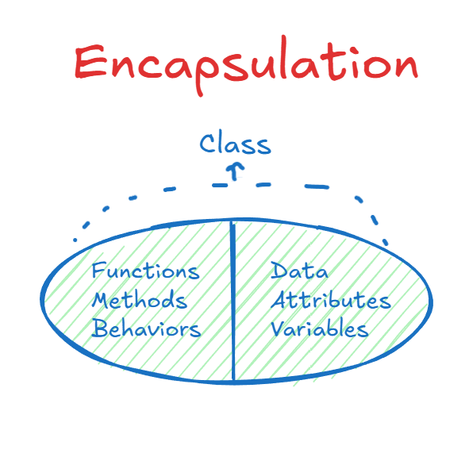

# 2. Encapsulation

## Concept

Encapsulation means wrapping the data and the behavior that works on that data into a single unit (the class), and controlling who can access what inside it.

The word comes from "capsule". Everything the class needs is sealed inside one place, with a public part that others can use and a private part that stays internal.

---

## Explanation

Think of a car's gearbox or the buttons on a washing machine. You do not touch the motor, the gears, or the water valves directly. You press a button or move the gear stick, and the machine does the work internally. The maker decided which controls you are allowed to use, so you cannot accidentally break something.

Classes work the same way. Instead of scattering the pieces of one idea across the program (and duplicating them wherever they are needed), you put everything in one class and expose only what the outside world should use.

Encapsulation gives you two main benefits:

1. **Organization**: the data and the code that manages it live together. The thing responsible for the data is also responsible for its rules and behavior.
2. **Protection**: you decide who can read or change the data, so it cannot be put into an invalid state by mistake.

A common misunderstanding is that encapsulation is only data hiding. Hiding data is one tool it uses, but the bigger idea is grouping data and behavior together. Even if your attributes are public, a class that holds both its data and the methods that enforce its rules is still encapsulated.

---

## Access Modifiers

Access modifiers define the scope in which a member (attribute or method) can be used.

| Modifier | Who can access it |
|---|---|
| `public` | Anywhere in the program |
| `private` | Only inside the same class |
| `protected` | Inside the class and inside any class that inherits from it (see file 3) |
| default (no keyword) | Any class in the same package or folder (Java only) |

Notes on C++:

- C++ has `public`, `private`, and `protected`. It has no "default/package" level, because C++ has no packages.
- Members of a `class` are private by default. Members of a `struct` are public by default.

---

## Getters and Setters

If every attribute is private, how do we use them from outside the class, even after creating an object? We provide public methods that act as controlled doors:

- **Getter**: a method that returns the value of a private attribute.
- **Setter**: a method that changes the value of a private attribute.

The advantage over a public attribute is that the setter can validate the input. A setter for `age` can refuse negative numbers. A public attribute would accept anything.

---

## Code (C++)

Without encapsulation, anyone can put the object into an invalid state:

```cpp
class BankAccount {
public:
    double balance;
};

int main() {
    BankAccount acc;
    acc.balance = -5000;   // nothing stops this
}
```

With encapsulation, the balance is private and every change goes through methods that enforce the rules:

```cpp
#include <iostream>
#include <string>
using namespace std;

class BankAccount {
private:
    string owner;
    double balance;

public:
    BankAccount(string o, double initial) {
        owner = o;
        balance = (initial >= 0) ? initial : 0;
    }

    // Getters
    string getOwner() const { return owner; }
    double getBalance() const { return balance; }

    // Setter with validation
    void setOwner(string newOwner) {
        if (!newOwner.empty()) owner = newOwner;
    }

    // Behavior that follows the account's rules
    void deposit(double amount) {
        if (amount > 0) balance += amount;
    }

    bool withdraw(double amount) {
        if (amount > 0 && amount <= balance) {
            balance -= amount;
            return true;
        }
        return false;   // rejected: invalid amount or insufficient funds
    }
};

int main() {
    BankAccount acc("Sara", 1000);
    acc.deposit(500);
    acc.withdraw(200);
    cout << acc.getBalance() << "\n";   // 1300

    // acc.balance = -5000;             // compile error: balance is private
}
```

The outside code can use `deposit`, `withdraw`, and `getBalance`, but it can never set the balance to a nonsense value directly.



---

## Summary

- Encapsulation groups data and behavior into one class.
- Access modifiers decide what is visible from outside.
- Getters and setters give controlled access to private data.
- The result is safer code that is easier to change, because the internals can be modified without breaking the code that uses the class.
