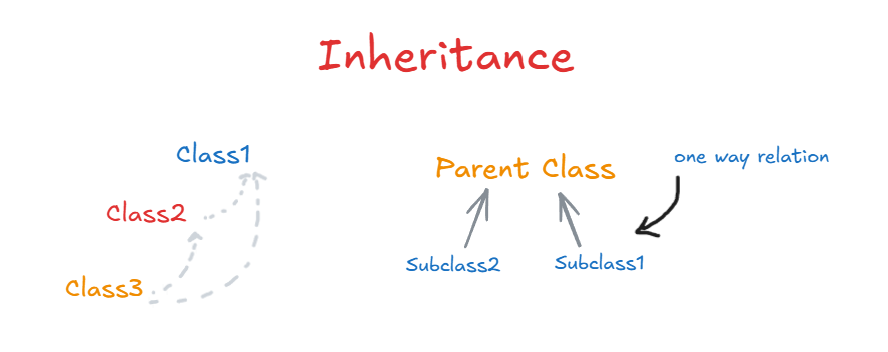
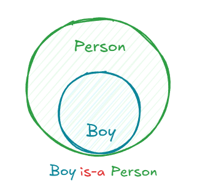

# 3. Inheritance

## Concept

Inheritance lets one class acquire the attributes and methods of another class, so common code is written once and reused.

- The class being inherited from is the **parent class** (also called superclass or base class).
- The class that inherits is the **child class** (also called subclass or derived class).

---

## Explanation

While writing classes, you may notice you are repeating the same attributes and methods in several of them. Writing the same code twice means you are not getting the benefit of OOP. The fix is to put the shared parts in one parent class and let the other classes inherit from it.

The relationship goes in one direction only:

- The child can use everything `public` or `protected` in the parent.
- The parent knows nothing about what exists inside the child.

Suppose we have a `Person` class with attributes, getters, and setters. A `Boy` class that inherits from `Person` automatically gets all of them. It can use the inherited attributes and methods, and it can add its own on top.

The relationship is called **is-a**: a `Boy` is a `Person`, a `Dog` is an `Animal`. If the sentence "child is a parent" sounds wrong, inheritance is probably the wrong tool.





---

## Types of Inheritance

| Type | Description |
|---|---|
| Single | One child inherits from one parent |
| Multilevel | A chain: C inherits from B, which inherits from A |
| Hierarchical | Several children inherit from the same parent |
| Multiple | One child inherits from more than one parent |

Not every language allows multiple inheritance. C++ and Python do. Java does not allow it for classes (a Java class can only extend one class), but it allows a class to implement many interfaces, which covers most of the same needs (see file 4).

---

## Code (C++)

```cpp
#include <iostream>
#include <string>
using namespace std;

class Person {
protected:                       // visible to child classes
    string name;
    int age;

public:
    Person(string n, int a) : name(n), age(a) {}
    virtual ~Person() = default;

    string getName() const { return name; }

    virtual void introduce() const {
        cout << "I am " << name << ", " << age << " years old\n";
    }
};

class Boy : public Person {      // Boy inherits from Person
private:
    string school;

public:
    // Calls the parent constructor first, then sets its own attribute
    Boy(string n, int a, string s) : Person(n, a), school(s) {}

    void playFootball() const {
        cout << name << " is playing football\n";   // name is inherited
    }
};

int main() {
    Boy b("Youssef", 12, "Nile School");
    b.introduce();       // inherited from Person
    b.playFootball();    // defined in Boy
}
```

---

## Constructors in Inheritance

When a child object is created, the parent part of the object has to be built first. So a child constructor calls a parent constructor, and also takes care of its own parameters.

- In C++ this is done with an initializer list: `Boy(...) : Person(n, a)`.
- In Java and Kotlin it is done with `super(...)`.

The order is always parent constructor first, then child constructor.

---

## Overriding

### Concept

Overriding means redefining a method that was inherited from the parent, inside the child class, so the child gets its own version.

### Explanation

Sometimes a child needs a method to behave a little differently, or to do slightly more than the parent's version, without changing the parent or any other child. You override the method in the child.

Often you do not want to throw away the parent's behavior, only extend it. In that case the child's version first calls the parent's version, then adds its own code:

- In Java: `super.methodName()`
- In C++: `ParentClass::methodName()` (C++ has no `super` keyword)

In Java, `@Override` is an annotation: a note that tells the compiler (and the reader) that this method is not new, it replaces one from the parent. C++ has the equivalent keyword `override`. If you write `override` on a method that does not actually match a parent method, the compiler gives an error, which catches typos.

In C++, the parent method must be marked `virtual` for overriding to work properly at runtime (more on this in file 5).

### Code (C++)

```cpp
class Boy : public Person {
    string school;
public:
    Boy(string n, int a, string s) : Person(n, a), school(s) {}

    void introduce() const override {
        Person::introduce();                       // run the parent version first
        cout << "I study at " << school << "\n";   // then add extra behavior
    }
};

int main() {
    Boy b("Youssef", 12, "Nile School");
    b.introduce();
    // I am Youssef, 12 years old
    // I study at Nile School
}
```

Other classes that inherit from `Person` keep the original `introduce()` and are not affected.

---

## Composition

### Concept

Composition means building a class out of other objects. Instead of saying "X is a Y" (inheritance), it says "X has a Y".

### Explanation

Inheritance is not always the right first choice. Deep inheritance trees become rigid and fragile: a change in a class near the top can break every class below it. In many situations it is better to build complex classes out of simpler components.

Composition is a relationship between **objects**, not between classes. For example, a `Car` needs an `Engine`. A `Car` is not an engine, so inheritance makes no sense, but a car has one. We create an `Engine` object inside the `Car` class and use it like any other data type.

Rule of thumb:

- "is-a" -> inheritance
- "has-a" -> composition

[Composition](../Media/compostion.png)

### Code (C++)

```cpp
class Engine {
public:
    void start() { cout << "Engine started\n"; }
};

class Car {
private:
    Engine engine;        // Car has an Engine

public:
    void drive() {
        engine.start();   // Car uses its Engine
        cout << "Car is moving\n";
    }
};
```

---

## Association, Aggregation, and Composition

These three describe how objects of different classes relate to each other. Aggregation and composition are special cases of association. The difference between all three is how strongly the objects depend on each other.

| Relationship | Strength | Meaning | Example |
|---|---|---|---|
| Association | Loose | Two objects use each other, no ownership | Owner and Pet |
| Aggregation | Weak relation | One object holds another, but the part can exist alone | School and Student |
| Composition | Strong relation | One object owns another, and the part cannot exist without it | House and Room |

Inheritance (also called generalization) is a different kind of relationship. It is between classes, not objects: a `Dog` is an `Animal`.

### Association

Two objects work together, but neither one owns the other and each exists independently. An `Owner` feeds a `Pet`, and the `Pet` pleases the `Owner`.

[Association](../Media/association.png)

```cpp
#include <iostream>
#include <string>
using namespace std;

class Pet {
public:
    string name;
    Pet(string n) : name(n) {}
};

class Owner {
public:
    void feed(const Pet& pet) {
        cout << "Feeding " << pet.name << "\n";
    }
};

int main() {
    Pet cat("Luna");
    Owner sara;
    sara.feed(cat);      // Owner uses Pet, but owns nothing
}
```

### Aggregation (weak relation)

A `School` has `Student`s, and a student is part of the school. But if a school is closed or has no students, the students are still real objects that exist on their own, and the school can exist as an independent entity too. The `School` only holds references to students it does not control.

[Aggregation](../Media/aggregation.png)

```cpp
#include <vector>

class Student {
public:
    string name;
    Student(string n) : name(n) {}
};

class School {
    vector<Student*> students;          // references only, no ownership
public:
    void enroll(Student* s) { students.push_back(s); }
};

int main() {
    Student karim("Karim");
    {
        School school;
        school.enroll(&karim);
    }                                   // school destroyed
    cout << karim.name << " still exists\n";
}
```

### Composition (strong relation)

A `House` is made of `Room`s. If the `House` object is deleted, all of its `Room` objects are destroyed with it, because their lifecycle depends entirely on the house. A room has no meaning outside of a house.


```cpp
class Room {
public:
    string name;
    Room(string n) : name(n) {}
};

class House {
    vector<Room> rooms;                 // rooms are stored inside the house
public:
    void addRoom(string n) { rooms.push_back(Room(n)); }
};                                      // when House is destroyed, so are its rooms
```

The `Car` and `Engine` example earlier in this file is also composition.


---

## Summary

- Inheritance reuses code through an **is-a** relationship.
- The child sees the parent's public and protected members, never the other way around.
- Overriding lets a child change or extend an inherited method.
- Prefer composition (**has-a**) when the relationship is not truly is-a.
- Association, aggregation, and composition describe ownership and lifetime between objects.
