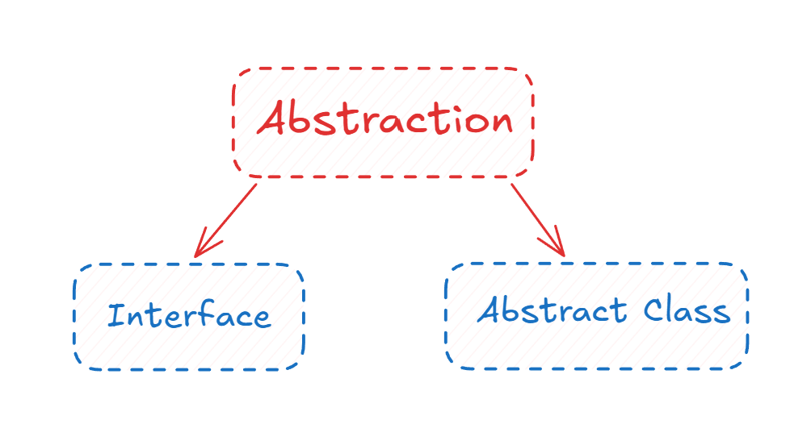
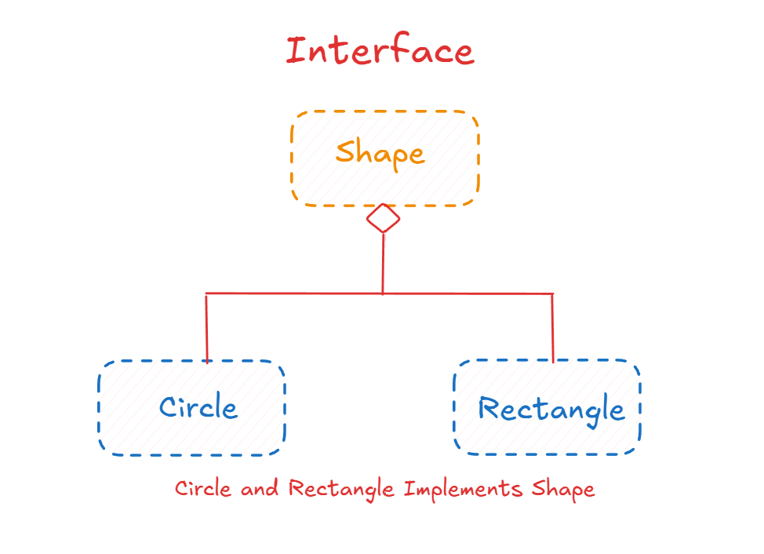

# 4. Abstraction

## Concept

Abstraction means focusing on what an object does and hiding how it does it. You remove the details that do not matter for the current purpose and keep the essential core.

---

## Explanation

Think of a barcode scanner. It passes over every item and reads its code. It does not care what the item is used for or what it means. It only deals with the one thing that matters to it: the barcode. Everything else about the item is irrelevant to the scanner, so it is ignored.

In code, abstraction works the same way. Suppose you have a `Zoo` with `Dog`, `Cat`, and `Bird` classes, and you keep adding more animals with details they all share. Instead of repeating those shared details everywhere, you create an `Animal` class that holds the common parts. `Animal` describes an idea that is real enough to build on, but you would never create a plain "animal" object, because no animal is just an animal. It has no specific meaning on its own. That is an **abstract class**.

Abstraction is a concept (a design goal). Abstract classes and interfaces are the tools used to apply it.

### Abstraction vs. Encapsulation

They are often confused:

- **Encapsulation** bundles data and methods and controls access. It is about protecting and organizing.
- **Abstraction** hides complexity and exposes only the essential idea. It is about simplifying.

An abstract method hides the implementation from the caller: you call `makeSound()` and do not need to know how each animal produces its sound.

<p align="center">
  
</p>

---

## Abstract Classes

### Concept

An abstract class is a class that cannot be instantiated. It is meant to be inherited from, and it may contain both complete methods and incomplete (abstract) ones.

### Explanation

- You cannot create objects from an abstract class.
- It can contain regular attributes, including private ones.
- It can contain two kinds of methods: regular methods with a full implementation, and abstract methods with no implementation.
- Any child class that wants to be a complete (concrete) class must implement all the inherited abstract methods.
- It combines features of a regular class and an interface.

Back to the zoo: instead of writing a separate sound function for each animal, the abstract `Animal` class declares an abstract `makeSound()`. Each child implements it in its own way. Shared behavior like `eat()` is written once in `Animal`. This reduces repeated code, lets you treat all animals as one category, and prevents mistakes because every animal is forced to provide a sound.

An abstract class is a good fit when your objects belong to one category and you do not care about their exact type, as long as you can handle them together.

### Code (C++)

In C++, a class becomes abstract when it has at least one **pure virtual function**, declared with `= 0`.

```cpp
#include <iostream>
#include <string>
using namespace std;

class Animal {                          // abstract class
protected:
    string name;                        // regular attribute

public:
    Animal(string n) : name(n) {}
    virtual ~Animal() = default;

    void eat() const {                  // regular method, shared by all
        cout << name << " is eating\n";
    }

    virtual void makeSound() const = 0; // abstract method: no implementation
};

class Dog : public Animal {
public:
    Dog(string n) : Animal(n) {}
    void makeSound() const override { cout << name << " says Woof\n"; }
};

class Cat : public Animal {
public:
    Cat(string n) : Animal(n) {}
    void makeSound() const override { cout << name << " says Meow\n"; }
};

int main() {
    // Animal a("x");    // error: cannot create an object of an abstract class
    Dog d("Rex");
    Cat c("Luna");
    d.eat();
    d.makeSound();
    c.makeSound();
}
```

---

## Interfaces

### Concept

An interface is a pure contract. It lists the methods a class must have, without saying how they work.

### Explanation

- All of its methods are abstract: no implementation.
- You cannot create objects from it. Its purpose is to be an idea that other classes follow.
- A class that follows an interface must implement every method in it. This is why it is called a contract.
- Where a class "inherits" from a parent, here the class "implements" the interface. It does not take over attributes, it takes on a promise to provide certain behavior.
- A class can implement many interfaces at once, even if it already inherits from another class.

In Java, an interface can only hold properties that are `public static final`:

- `public`: accessible from anywhere.
- `static`: accessible without creating an object.
- `final`: the value cannot be changed after it is set. Interface properties must also be given a value immediately.

C++ has no `interface` keyword. The usual way to get the same effect is an abstract class made only of pure virtual functions and no data.

<p align="center">
  
</p>

### Code (C++)

```cpp
#include <iostream>
using namespace std;

class Shape {                           // interface
public:
    virtual ~Shape() = default;
    virtual double area() const = 0;
    virtual double perimeter() const = 0;
};

class Circle : public Shape {
    double radius;
public:
    Circle(double r) : radius(r) {}
    double area() const override      { return 3.14159 * radius * radius; }
    double perimeter() const override { return 2 * 3.14159 * radius; }
};

class Rectangle : public Shape {
    double width, height;
public:
    Rectangle(double w, double h) : width(w), height(h) {}
    double area() const override      { return width * height; }
    double perimeter() const override { return 2 * (width + height); }
};

int main() {
    Circle c(5);
    Rectangle r(4, 6);
    Shape* shapes[] = { &c, &r };

    for (Shape* s : shapes) {
        cout << s->area() << "\n";     // each shape computes it its own way
    }
}
```

`Circle` and `Rectangle` implement `Shape`: both are forced to provide `area()` and `perimeter()`, and the code that uses `Shape` does not need to know which one it has.

A class can follow more than one contract at once:

```cpp
class Printable {                       // a second interface
public:
    virtual ~Printable() = default;
    virtual void print() const = 0;
};

class Square : public Shape, public Printable {
    double side;
public:
    Square(double s) : side(s) {}
    double area() const override      { return side * side; }
    double perimeter() const override { return 4 * side; }
    void print() const override       { cout << "Square of side " << side << "\n"; }
};
```

---

## Abstract Class vs. Interface

| | Abstract class | Interface |
|---|---|---|
| Relationship | **is-a** (shared identity) | **can-do** (shared ability) |
| Idea | An incomplete version of something real | A contract or catalog of behaviors |
| Methods | Both implemented and abstract | Abstract only (in the classic sense) |
| Attributes | Allowed, any access level | Only constants in Java, none in C++ |
| Use when | Subclasses share a common identity and code | Unrelated classes must share a capability |
| Example | `Vehicle` -> `Car`, `Truck` | `Flyable` -> `Airplane`, `Bird` |

A `Car` is a `Vehicle`, so `Vehicle` is a good abstract class. An `Airplane` and a `Bird` are not related, but both can fly, so `Flyable` is a good interface.

---

## Summary

- Abstraction hides implementation details and exposes the essential idea.
- It is a design concept, applied through abstract classes and interfaces.
- Neither can be instantiated.
- Use an abstract class for shared identity and shared code, and an interface for a shared capability across unrelated classes.
- Abstraction is what makes polymorphism useful, which is the topic of file 5.
