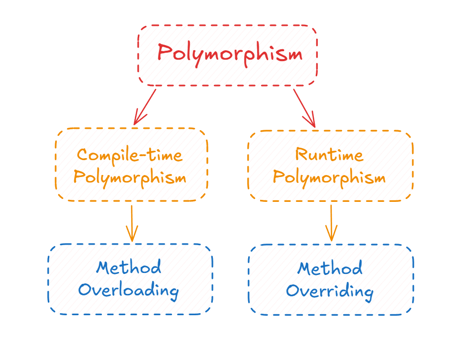

# 5. Polymorphism

## Concept

Polymorphism means "many forms". The same name or call can produce different behavior depending on the context.

---

## Explanation

Think of a piece of clay. You can shape it into a person, an animal, or anything else. It is the same material taking different forms.

Or take a photo of an animal. One person can describe it as "a picture of a dog", another as "a picture of an animal". Both are correct, so the same photo has two valid forms.

In OOP, polymorphism lets you treat objects of different classes through one common type, while each object still behaves in its own way. It works hand in hand with abstraction. You call `makeSound()` on every animal in the zoo with the same line of code, but a dog barks and a cat meows. The call is the same, the implementation inside each class is different.

There are two kinds:

| | Compile-time (static) | Run-time (dynamic) |
|---|---|---|
| Resolved | Before the program runs | While the program runs |
| Achieved by | Method overloading (and constructor overloading) | Method overriding with inheritance |
| Also called | Static binding, early binding | Dynamic binding, late binding |

<p align="center">
  
</p>
---

## Method Overloading (Compile-Time)

### Concept

Overloading means defining several methods with the same name in the same class, as long as their parameter lists are different.

### Explanation

The parameter list is called the **signature**. To overload a method you change the signature by:

1. changing the number of parameters,
2. changing the data types of the parameters, or
3. changing the order of the data types.

You cannot overload by changing only the return type. The compiler decides which version to call by looking at the arguments you pass, which is why this is resolved at compile time.

Constructors are a good example. A class can have a default constructor and several parameterized ones, all with the same name, and the right one is chosen from the arguments at creation.

### Code (C++)

```cpp
#include <iostream>
#include <string>
using namespace std;

class Calculator {
public:
    int add(int a, int b) {
        return a + b;
    }
    double add(double a, double b) {        // different types
        return a + b;
    }
    int add(int a, int b, int c) {          // different number of parameters
        return a + b + c;
    }
    void show(int a, string b) { cout << a << " " << b << "\n"; }
    void show(string a, int b) { cout << a << " " << b << "\n"; }   // different order
};

int main() {
    Calculator calc;
    cout << calc.add(2, 3) << "\n";         // calls add(int, int)
    cout << calc.add(2.5, 3.5) << "\n";     // calls add(double, double)
    cout << calc.add(1, 2, 3) << "\n";      // calls add(int, int, int)
}
```

Constructor overloading:

```cpp
class Point {
public:
    int x, y;
    Point() : x(0), y(0) {}
    Point(int v) : x(v), y(v) {}
    Point(int a, int b) : x(a), y(b) {}
};

Point p1;          // (0, 0)
Point p2(5);       // (5, 5)
Point p3(2, 7);    // (2, 7)
```

### How the compiler picks an overload

When you call an overloaded method, the compiler looks at the arguments and picks the closest match: first an exact match, then a small widening (like `char` to `int` or `float` to `double`), then any other conversion (like `int` to `double`). If two overloads are equally close, the call is ambiguous and the code does not compile.

```cpp
void f(long x)   { }
void f(double x) { }

f(5L);    // fine: exact match for long
f(5);     // error: ambiguous, int to long and int to double are equally close
```

---

## Method Overriding (Run-Time)

### Concept

Overriding means redefining a parent class method inside a child class. Which version runs is decided at runtime, based on the real type of the object.

### Explanation

If the parent is `Animal` and the children are `Dog` and `Cat`, you can hold a `Dog` or a `Cat` through an `Animal` reference or pointer. The parent type is the form you use, and the real object decides the behavior. In Java:

```java
Animal a1 = new Dog();
Animal a2 = new Cat();
```

The program only knows at runtime that `a1` is really a `Dog`, so `a1.makeSound()` runs the dog's version.

Requirements:

- The parent method needs the same name and exactly the same parameters.
- Inheritance is required.
- The return type must be the same or a subtype (covariant return type).
- In C++, the parent method must be declared `virtual`. Without it, the compiler picks the method based on the pointer type, not the object, and you do not get polymorphism. Under the hood, every class with virtual functions has a small table of function pointers (the vtable), and every object holds a hidden pointer to its class's table. That is how the program finds the right version at runtime, and it is also why virtual calls are slightly slower than normal ones.

### Code (C++)

```cpp
#include <iostream>
#include <vector>
#include <memory>
using namespace std;

class Animal {
public:
    virtual ~Animal() = default;
    virtual void makeSound() const { cout << "Some generic sound\n"; }
};

class Dog : public Animal {
public:
    void makeSound() const override { cout << "Woof\n"; }
};

class Cat : public Animal {
public:
    void makeSound() const override { cout << "Meow\n"; }
};

int main() {
    // Base type pointers, derived type objects
    vector<unique_ptr<Animal>> zoo;
    zoo.push_back(make_unique<Dog>());
    zoo.push_back(make_unique<Cat>());
    zoo.push_back(make_unique<Dog>());

    for (const auto& animal : zoo) {
        animal->makeSound();    // same call, different behavior
    }
    // Woof
    // Meow
    // Woof
}
```

The loop does not know or care which animal it is dealing with. If a `Bird` class is added tomorrow, this loop works for it without any change.

### Common overriding mistakes

**1. Not writing `override`.** To override a method, the child's signature must match the parent's exactly, including `const`. If it does not match, you have not overridden anything, you have created a new unrelated method, and nothing warns you unless you wrote `override`.

```cpp
class Animal {
public:
    virtual void speak() const { cout << "...\n"; }
    virtual ~Animal() = default;
};

class Dog : public Animal {
public:
    void speak() { cout << "Woof\n"; }   // missing const: NOT an override
};

int main() {
    Dog d;
    Animal* a = &d;
    a->speak();    // prints "..." and not "Woof"
}
```

With `void speak() override`, the compiler reports an error and the bug is caught immediately. Always write it.

**2. A non-virtual destructor.** If a class is used through a base pointer, its destructor must be `virtual`. Otherwise `delete` on a base pointer runs only the base destructor, and the child part is never cleaned up.

```cpp
class Base {
public:
    virtual ~Base() { cout << "Base destroyed\n"; }   // without virtual, Derived's destructor is skipped
};
```

Rule of thumb: if a class has any virtual function, give it a virtual destructor. This is why the earlier examples include `virtual ~Animal() = default;`.

**3. Object slicing.** Overriding only works through pointers and references. If a child object is copied into a parent object by value, the child part is cut off, and so is the overridden behavior.

```cpp
void byValue(Animal a)            { a.speak(); }   // sliced: prints "..."
void byReference(const Animal& a) { a.speak(); }   // works: prints "Woof" for a Dog
```

For the same reason, store polymorphic objects as pointers (`vector<unique_ptr<Animal>>`), never as `vector<Animal>`.

---

## Overloading vs. Overriding

| | Overloading | Overriding |
|---|---|---|
| Definition | Same method name, different parameters, in one class | Redefining a parent method inside a child class |
| Parameters | Must be different (number, type, or order) | Must be exactly the same |
| Inheritance | Not needed | Required |
| Return type | Same or different (but cannot be the only difference) | Same or a subtype |
| Polymorphism type | Compile-time (static binding) | Run-time (dynamic binding) |
| C++ keywords | None | `virtual` in parent, `override` in child |

---

## Summary

- Polymorphism lets one interface produce many behaviors.
- Overloading is resolved by the compiler from the signature.
- Overriding is resolved at runtime from the real type of the object.
- Always write `override` so signature mistakes become compile errors.
- Give base classes a virtual destructor, and pass polymorphic objects by pointer or reference, never by value.
- Combined with abstraction, it lets you write code against a general type (`Animal`) and have it work with every specific type (`Dog`, `Cat`, and any future one).
